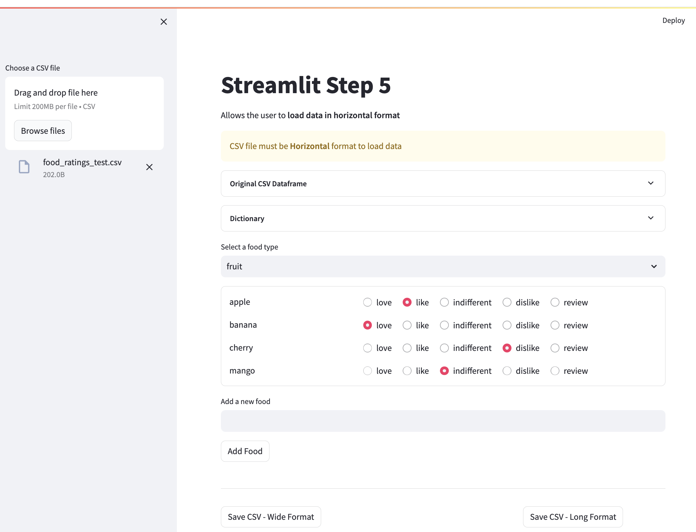

# Streamlit - Step by Step

## Description

A step by step approach to understanding Streamlit, useful for quickly building user interfaces in Python.

## Pre-resquisites

The code is written in Python, utilising Pandas and Streamlit and is packaged using Poetry. It is assumend Poetry is installed on your local system.

The **pyproject.toml** file can be viewed to determine the dependancies in use by this code, these will automatically be installed when the installation steps below are followed.

## Installation

Clone the repository and install dependencies:

```bash
git clone <this-repository>
cd <this-repository>
poetry install
```

## Steps

Streamlit concepts are taught in a step by step approach by building a simple food rating application.

The steps show how to load data from CSV files, store session data persistently, overwrite UI dynamically based on user actions and output the data to a CSV file.

### Example Application Screenshot



**streamlit_step_1.py** - Simple UI. Create a selection box to choose a food type and see that food type with optional ratings displayed as a list of radio buttons. A placeholder element is used to hold the list of radio buttons, this is useful in later steps when new food types are added to the list.

**streamlit_step_2.py** - Updates the UI from step 1 to allow user choices to persist when food categories are changed. This step introduces session state.

**streamlit_step_3.py** - Updates the UI from step 2 to introduce the ability to add new food items to the list of radio buttons so that the user can update the seed data. Shows the use of input_text element and button elements.

**streamlit_step_4.py** - Updates the UI from step 3 to add the capability to write a CSV file based off of the selections the user has made. The CSV can be written in a long or wide format. Error handling is added to ensure if file issues occur the Streamlit outputs a useful message in an appropriate error element.

**streamlit_step_5.py** -Updates the UI from step 4 to allow the user to upload data from a specified CSV file. This step introduces the Streamlit sidebar element.

## Usage

Execute the desired step by running

```bash
poetry run streamlit run src/streamlit_in_steps/streamlit_step_<number>.py
```

A local web browser will be launched on <http://localhost:8502/> running the streamlit application

Output is written to $PROJECT_ROOT/output/food_ratings.csv

## Additional Information

Streamlit official documentation - <https://docs.streamlit.io/library/api-reference>
